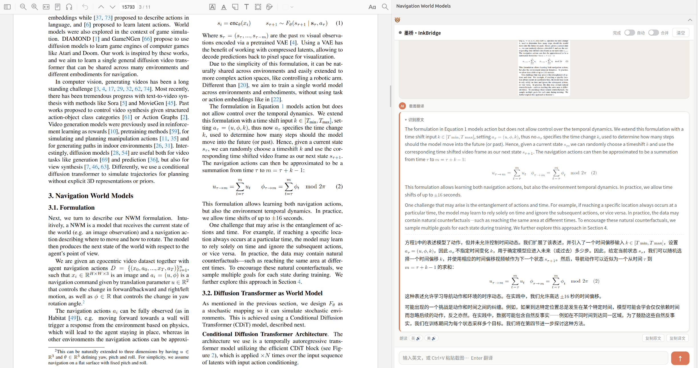

<p align="center"></p>

# 墨桥·InkBridge

Zotero PDF 阅读器里的中英学术互译：选中即译、单词查词、带公式的截图翻译、英文发音。模型全部在本地电脑上运行，插件不调用任何在线服务。



## 组件

插件本身只提供界面，各项功能由下面四个组件提供。**每个组件都是选装的**，部署了哪个，就能用哪项功能：

| 组件                       | 提供的功能                                   | 运行条件                        |
| -------------------------- | -------------------------------------------- | ------------------------------- |
| 文本翻译（HY-MT1.5-1.8B）  | 选中或输入文字后翻译，英译中、中译英自动判断 | NVIDIA 显卡 + vLLM              |
| 截图翻译（HunyuanOCR-1.5） | 识别截图并翻译，公式保留为 LaTeX 并渲染      | NVIDIA 显卡 + vLLM              |
| 离线词典（ECDICT）         | 英文单词查词、中文词反查英文                 | 一个约 78 MB 的文件，不需要显卡 |
| 发音（Kokoro-82M）         | 单词发音、朗读卡片中的英文                   | 只需 CPU                        |

组件之间的关系：

- **查词与翻译**：选中单词或短语（不超过 4 个词）、或 1–8 个汉字时，先查词典；词典未配置或查不到，再交给文本翻译。所以只装词典时只能查词，不能翻译句子；只装文本翻译时也能翻译单词，但没有音标和完整词义。
- **截图翻译**：默认使用系统自带的截图功能，该功能是独立的，不依赖其他组件。
- **发音**：发音按钮始终显示，没有部署发音服务时，点击会提示不可用。
- **显存**：文本翻译和截图翻译同时运行约占 9.3 GB 显存，建议显卡显存 12 GB 以上。
- **跨电脑使用**：组件可以部署在另一台电脑上，例如在家里使用办公室电脑的显卡，见[远程访问](#远程访问)。

## 安装插件

1. 从 [Releases](https://github.com/MaiZiPiaoPiao/InkBridge/releases/latest) 下载 `inkbridge.xpi`，或在仓库根目录运行 `python3 tools/build_xpi.py` 自行打包（生成 `dist/inkbridge.xpi`）。
2. 在 Zotero「工具 → 插件」中，点齿轮菜单 →「从文件安装插件」，选择 `inkbridge.xpi`，然后重启 Zotero。之后 Zotero 会自动更新插件。
3. 按下文部署需要的组件，再到 Zotero「设置 → 墨桥·InkBridge」中填写服务地址、选择词典文件，然后点「测试连接」。未部署的服务显示「无法连接」，未选择词典显示「未设置」，都不影响其他功能。

需要 Zotero 8 / 9 / 10。

## 部署组件

以下步骤在 Linux 上测试通过；Windows 也可以部署，但需要自行调整命令。`<MODEL_DIR>` 是存放模型的目录，请替换为你自己的路径。

### 文本翻译、截图翻译

两者都基于 vLLM，先安装一次 vLLM：

```bash
conda create -n vllm python=3.12 -y && conda activate vllm
pip install uv && uv pip install vllm --torch-backend=auto
```

只下载需要的模型：

```bash
# 文本翻译（约 4 GB）
pip install modelscope
modelscope download --model Tencent-Hunyuan/HY-MT1.5-1.8B --local_dir <MODEL_DIR>/HY-MT1.5-1.8B

# 截图翻译（约 2.3 GB；仓库根目录即 1.5 版本，其余子目录不需要）
hf download tencent/HunyuanOCR --exclude 'v1.0/*' --exclude 'dflash/*' --exclude 'assets/*' \
    --local-dir <MODEL_DIR>/HunyuanOCR-1.5
```

国内网络可在 `hf download` 前加 `HF_ENDPOINT=https://hf-mirror.com`。

启动服务，看到 `Application startup complete` 即可使用。两个都要启动时，请等前一个就绪后再启动下一个，否则显存探测会互相干扰：

```bash
# 文本翻译（约 30 秒就绪）
VLLM_USE_FLASHINFER_SAMPLER=0 vllm serve <MODEL_DIR>/HY-MT1.5-1.8B \
    --served-model-name hy-mt --host 127.0.0.1 --port 8001 \
    --max-model-len 4096 --gpu-memory-utilization 0.3 --enforce-eager

# 截图翻译（约 55 秒就绪）
VLLM_USE_FLASHINFER_SAMPLER=0 vllm serve <MODEL_DIR>/HunyuanOCR-1.5 \
    --served-model-name hy-ocr --host 127.0.0.1 --port 8002 --trust-remote-code \
    --limit-mm-per-prompt '{"image":1,"video":0}' \
    --max-model-len 8192 --max-num-batched-tokens 8192 \
    --gpu-memory-utilization 0.35 --enforce-eager
```

- `--enforce-eager` 必须加：vLLM 对混元系列使用 transformers 实现，与 CUDA 图捕获冲突。
- `VLLM_USE_FLASHINFER_SAMPLER=0`：没有安装 CUDA 编译器 `nvcc` 时需要。
- `--served-model-name` 必须与上面一致；截图翻译的 `--gpu-memory-utilization` 不能低于 0.35。
- 启动后第一次翻译较长文本时可能卡住几十秒（Triton 在编译内核），之后恢复正常。

### 离线词典

数据来自 [ECDICT](https://github.com/skywind3000/ECDICT)（约 77 万词条）。运行脚本自动下载并生成词典，只依赖 Python 标准库：

```bash
python3 tools/build_ecdict.py <MODEL_DIR>/ecdict.db
```

已下载 `ecdict.csv` 时可加 `--csv ecdict.csv` 跳过下载。插件更新后，如果「测试连接」显示词典「需重新生成」，重新运行上面的命令即可。

### 发音

`tools/tts_server.py` 使用 [kokoro-onnx](https://github.com/thewh1teagle/kokoro-onnx) 在 CPU 上合成语音，占用约 250 MB 内存。需要系统安装 espeak-ng（Ubuntu：`sudo apt install espeak-ng`）。

```bash
conda create -n tts python=3.12 -y && conda activate tts
pip install kokoro-onnx

mkdir -p <MODEL_DIR>/kokoro && cd <MODEL_DIR>/kokoro
curl -LO https://github.com/thewh1teagle/kokoro-onnx/releases/download/model-files-v1.0/kokoro-v1.0.int8.onnx
curl -LO https://github.com/thewh1teagle/kokoro-onnx/releases/download/model-files-v1.0/voices-v1.0.bin

python3 <仓库目录>/tools/tts_server.py --model-dir <MODEL_DIR>/kokoro --port 8003
```

## 远程访问

上面的服务都只监听 `127.0.0.1`，只有本机能访问。要从另一台电脑使用，按两台电脑的位置选择：

**同一局域网**：启动服务时把 `--host 127.0.0.1` 改为 `--host 0.0.0.0`（发音服务加上 `--host 0.0.0.0`），在另一台电脑的设置页填写 `<服务器局域网 IP>:8001` 等地址。注意：服务没有密码，同一局域网内的任何人都能使用。

**不在同一局域网（推荐 Tailscale）**：[Tailscale](https://tailscale.com) 把你的设备连成一个加密的私有网络，只有登录同一账号的设备才能互相访问，不需要公网 IP，也不用在路由器上做端口映射。服务保持只监听 `127.0.0.1`，由 Tailscale 转发进来：

1. 两台电脑都[安装 Tailscale](https://tailscale.com/download)，并用同一个账号登录。Windows、macOS 有图形客户端。
2. 在运行组件的电脑上，为已部署的服务开启转发：

   ```bash
   sudo tailscale up
   tailscale ip -4      # 本机的 Tailscale IP，形如 100.x.y.z
   sudo tailscale serve --bg --tcp 8001 tcp://127.0.0.1:8001
   sudo tailscale serve --bg --tcp 8002 tcp://127.0.0.1:8002
   sudo tailscale serve --bg --tcp 8003 tcp://127.0.0.1:8003
   ```

   用 `tailscale serve status` 查看转发，`sudo tailscale serve reset` 清除全部转发。
3. 在另一台电脑的设置页填写 `100.x.y.z:8001`、`100.x.y.z:8002`、`100.x.y.z:8003`。运行组件的电脑本机继续使用默认地址。

无论哪种方式，词典都是插件直接读取的本地文件，需要复制到另一台电脑，再在设置页中选择。

如果开着 Clash / Mihomo 等代理软件的 TUN 或 fake-ip 模式，`tailscale up` 可能一直卡住。解决方法：把 `+.tailscale.com`、`+.tailscale.io`、`+.ts.net` 加入 `dns.fake-ip-filter`，把 `100.64.0.0/10` 加入 `tun.route-exclude-address`。两台电脑都开着代理时，两边都要这样设置。

## 使用

打开 PDF，在右侧条目面板中找到「墨桥·InkBridge」。

- **选中翻译**：在 PDF 中选中文字即自动翻译；也可以在面板底部的输入框中输入。以中文为主的内容会译成英文。
- **手动翻译与跨页合并**：关闭 `自动` 开关后，选中的文字先放进输入框，按 F 再翻译。再打开 `合并` 开关，可以依次选中上一页末尾和下一页开头，合并后一起翻译；行尾断词（如 `compu-` + `tation`）会自动拼回。
- **截图翻译**：截图后点击输入框按 Ctrl+V，或把图片拖进面板。自动判断语言：英文截图译成中文，中文截图译成英文。
- **发音**：词典卡片中单词旁的「英 🔊」「美 🔊」播放单词发音；翻译卡片底部的「朗读」逐句朗读英文，再次点击停止。
- **不留痕迹**：翻译记录、截图、音频都只保存在内存中，关闭 Zotero 后不保留。

## 开发

- **翻译参数**：模型名、提示词、采样参数、长度上限等都是 `zotero-plugin/bootstrap.js` 顶部的常量，修改后重新打包。
- **直接加载源码**：在 Zotero 配置目录的 `extensions` 文件夹中新建文件 `inkbridge@maipeng.com`（没有扩展名），内容为 `<仓库目录>/zotero-plugin` 的绝对路径，然后重启 Zotero。修改没有生效时，用 `-purgecaches` 参数启动 Zotero。
- **发布新版本**：修改 `zotero-plugin/manifest.json` 中的 `version`，运行 `python3 tools/build_xpi.py`；在 GitHub 新建 tag 为 `v<版本号>`（如 `v1.2.0`）的 Release，上传 `dist/` 中的 `inkbridge.xpi` 和 `update.json`。Zotero 通过最新 Release 中的 `update.json` 检查更新，所以 tag 格式和文件名都不能改。

## 许可

本项目采用 [MIT](LICENSE) 许可。第三方组件：

- [KaTeX](https://katex.org/)：MIT，见 `zotero-plugin/chrome/content/lib/KATEX_LICENSE`
- [ECDICT](https://github.com/skywind3000/ECDICT)、[kokoro-onnx](https://github.com/thewh1teagle/kokoro-onnx)：MIT
- [Kokoro-82M](https://huggingface.co/hexgrad/Kokoro-82M)：Apache-2.0
- [HY-MT1.5](https://huggingface.co/tencent/HY-MT1.5-1.8B)、[HunyuanOCR](https://huggingface.co/tencent/HunyuanOCR)：遵循腾讯混元各自的许可协议

模型权重和词典数据都不包含在本仓库中。
